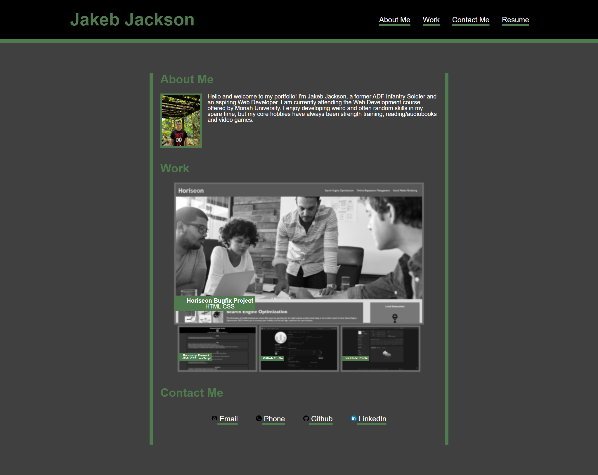

# Portfolio-CSS-Challenge
This is a repository for a portfolio website designed to show my progress and understanding of CSS for the Monash University Bootcamp.

## About this Repository
This repository is a part of the coursework for the Monash University Web Development Bootcamp, this is the Week 2 challenge for the course. The objectives for this project were as follows:
* **Create a portfolio website with your name and a recent picture.**
* **Create a functional navigation menu that will scroll the UI to the section selected by the user on click.**
* **When the user navigates to the work section they find an array of your projects with images showing previews, with one image larger than the rest.**
* **When the user clicks on the images they link to the deployed application.**
* **The user is presented with a responsive layout that adapts to various resolutions.**

## Challenges
By far the most challenging aspect of this project was alignment and positioning, I had been taught all of the required CSS commands however I quickly found out that I had not understood them very well. I found myself struggling to recall which alignment command was applicable for what, for example I had entirely forgotten about vertical-align and spent about 2 hours struggling to align images to the top of their division instead of the bottom. Similarly, I spent another hour losing my mind over why commands were seemingly not working and then discovered that I was using flex commands on non-flex elements. The second biggest challenge I found was CSS organisation, I probably spent a combined total of 50 minutes scrolling through my stylesheet file looking for the specific class I was trying to change, this was probably because when I was trouble shooting (creating classes/adjusting elements) I didn't always delete my useless and obselete code, making my CSS file something resembling a war zone of random, disorganised commands at one point. So my two key takeaways from this project were: 
1. If a property/command is having no effect check what its intended for and,
2. Keep things neat and organised, if not for the sake of readability, then for the sake of saving my own time.

## About the website
This website was a trial project, that was intended to resemble a developer portfolio with the functionality of offering potential employers the ability to both look at my projects and contact me.

## Mock-Up
Below is an image of the deployed application:

## Deployment
This website has been deployed and can be viewed [here](https://jakebjackson.github.io/Portfolio-CSS-Challenge/).
